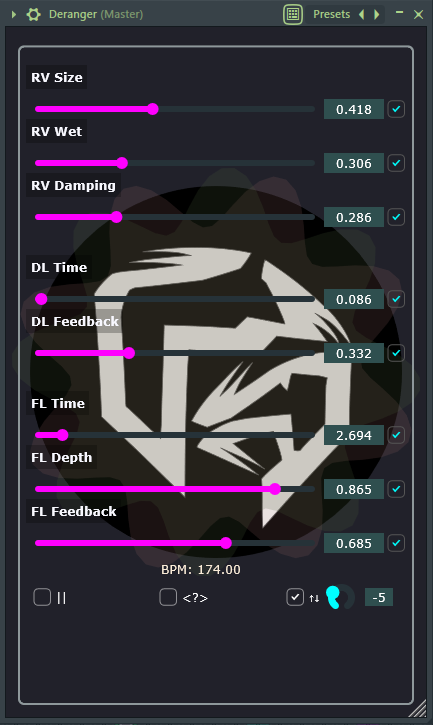

# Deranger

Combines Delay→Reverb→Flanger in series or in parallel, randomizes their parameters, and has ability to pitch-shift the audio thanks to [SignalSmith's Stretch library](https://github.com/Signalsmith-Audio/signalsmith-stretch).

Check out this demo showcasing the plugin’s sound design potential after resampling:

  

This project has been bootstrapped from:

[**JUCE CMake VSCode Example**](https://github.com/tomoyanonymous/juce_cmake_vscode_example)

---

## Plugin Snapshot

  

---

## Build Status

  

---

  

